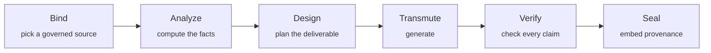

<p align="center">
  
</p>

<h1 align="center">AlchemyLake</h1>

<p align="center">
  <strong>Truth, made visible.</strong> The creative production layer for the lakehouse era.<br>
  Governed data in. Verified, provenance-sealed deliverables out.
</p>

<p align="center">
  <a href="https://app.alchemylake.com"></a>
  <a href="https://app.alchemylake.com/docs"></a>
  <a href="https://github.com/zorost/alchemylake-databricks/tags"></a>
  <a href="./LICENSE"></a>
  <a href="https://app.alchemylake.com/docs#developers"></a>
  <a href="https://app.alchemylake.com/api/status"></a>
</p>

<p align="center">
  <a href="https://app.alchemylake.com">Live app</a> ·
  <a href="https://app.alchemylake.com/docs">Docs</a> ·
  <a href="https://app.alchemylake.com/sign-up">Free: 200 credits, no card</a> ·
  <a href="https://app.alchemylake.com/templates">Template gallery</a> ·
  <a href="https://app.alchemylake.com/pricing">Pricing</a> ·
  <a href="https://github.com/zorost/alchemylake-databricks">Databricks bundle</a>
</p>

---

## What is AlchemyLake?

AlchemyLake turns the numbers your data platform already trusts into reports, imagery, and
media your brand can actually ship: board-ready **PowerPoint decks** with a read-aloud script
under every slide, enterprise **PDF dossiers** with Excel evidence workbooks, designed
**infographics**, animated **video briefings**, two-host **data podcasts**, sonified **music
scores**, and planned **deep-research investigations**. Every figure is computed from governed
rows by code, checked by a verifier after generation, metered by a real credit ledger, and
sealed to its source with provenance embedded in the file itself.

It binds to **Databricks Unity Catalog** tables, **Databricks Genie** spaces, uploaded
**CSV / Excel / PDF / Word / text** files, or a built-in sample lakehouse, and it is callable
from anywhere: the web **Studio**, a **CLI** (`npx alchemylake`), a public **REST API** with
an OpenAPI spec, and a **13-tool MCP server** that plugs into Claude, Cursor, VS Code, and
Databricks Genie / Agent Bricks. A product of [Zorost Intelligence](mailto:info@zorost.com).

## Contents

- [Why it exists](#why-it-exists)
- [The numbers discipline](#the-numbers-discipline)
- [The Studio: eight lanes, every one data-bound](#the-studio-eight-lanes-every-one-data-bound)
- [What people actually ask it for](#what-people-actually-ask-it-for)
- [Quick start](#quick-start)
- [Developers: one key, three doors](#developers-one-key-three-doors)
- [AlchemyLake + Databricks](#alchemylake--databricks)
- [Sources: four origins](#sources-four-origins)
- [Provenance and trust](#provenance-and-trust)
- [Pricing](#pricing)
- [Templates](#templates)
- [Roadmap](#roadmap)
- [FAQ](#faq)
- [Ecosystem](#ecosystem)
- [Community](#community)

## Why it exists

Data platforms got very good at governing numbers, and stop at the dashboard. Creative tools
got very good at making media, and have no idea where a number came from. The gap between the
two is where brands quietly ship wrong figures in beautiful decks.

AlchemyLake closes that gap with four commitments:

1. **The model never authors a number.** Every figure is computed from the bound rows by code;
   the model writes *around* facts. A verifier then checks every claim in the output and
   scores it.
2. **Provenance is the product.** Every generation is recorded with its prompt, model, status,
   cost, and seal (source, rows, sha256, verification), embedded into the file itself, in
   every format. An asset without its seal never ships.
3. **Every pixel is accounted.** A real append-only credit ledger meters all eight lanes.
   Failed runs auto-refund. No mystery invoices.
4. **Built for where data lives.** Unity Catalog tables, Genie answers, or uploaded files bind
   as governed sources, and a no-egress text tier keeps narrative inference on your own
   Databricks Foundation Model endpoints.

## The numbers discipline

Every render, from any lane, from any client, passes the same pipeline:



The exact rows you bind are snapshotted and hashed. Every figure is computed from those rows
by code, the deliverable is designed and generated around those facts, every numeric claim in
the output is checked against them and scored, and the seal (source, row count, data hash,
verification score) is embedded into the file itself, so provenance survives forwarding,
download, and print.

## The Studio: eight lanes, every one data-bound

| Lane | Credits | What ships |
|---|---:|---|
| **Analyst** (chat) | 1 (6 with Model Council) | A verified, sealed answer; follow-ups stay in context |
| **Deep Research** | 18 | A planned multi-step investigation: the brief decomposes into sub-questions, each answered with real evidence, synthesized into a sealed PDF dossier + Excel evidence workbook |
| **Report** | 10 | Enterprise PDF dossier (cover, KPI band, chart sections, statistical appendix, per-figure citations, methodology) + Excel evidence workbook |
| **Presentation** | 40 base (+4/slide over 5) | A .pptx board deck, 5 to 20 slides, AI cover art, hero-stat and chart slides, with a read-aloud presenter script and Q&A prep in every notes pane |
| **Infographic** | 45 | A designed KPI poster with the exact figures rendered in-image and a branded provenance strip |
| **Video Briefing** | 40 | An animated, narrated data video (mp4) in six showrunner formats: consultant walkthrough, newsroom segment, executive stand-up, documentary deep-dive, field report, social recap |
| **Podcast** | 25 | A NotebookLM-style two-host audio briefing (mp3) with a sealed transcript, in five formats |
| **Music** | 50 | A sonified score whose tempo follows your momentum and whose mode follows your trend, plus the literal data-motif WAV of the rows, in six genres |

Every run shows a live cost preview and an animated progress line in the Studio, and lands in
your private Vault with its seal.

## What people actually ask it for

Every lane binds to a governed source, so the figures in the output are the figures in your
table, not a paraphrase. A sample of real workflows:

| Lane | Ships | Example asks |
|---|---|---|
| **Analyst** | A sealed, sourced answer; follow-ups stay in context | *"Draft the board narrative from the certified loan book."* · *"Now break that down by region."* |
| **Deep Research** | A sealed investigation dossier (PDF + Excel) | *"Why did Q3 dip, and what should we do about it?"* · *"Investigate concentration risk across our segments."* |
| **Infographic** | A KPI poster, figures rendered in-image | *"This week's sales milestone, ready for social."* · *"'45 days without a recordable incident' for the plant floor."* |
| **Report** | PDF dossier + Excel evidence workbook | *"Quarterly board-packet narrative, sealed."* · *"Compliance rollup with a hash of the source data baked in."* |
| **Presentation** | .pptx, speaker script + Q&A per slide | *"QBR deck with the CRM's exact numbers."* · *"A steering-committee deck anyone on the team can present cold."* |
| **Video briefing** | A narrated, animated data video | *"All-hands opener with the real ARR on screen."* · *"A 30-second earnings-day teaser, safe to post at the bell."* |
| **Music** | A score that follows the actual trend | *"A launch-video bed whose tempo rises with the real growth curve."* |
| **Podcast** | A two-host audio briefing + transcript | *"A 3-minute briefing leadership can play on the commute."* · *"An audio version of the same sealed report, for accessibility."* |

## Quick start

### 1. In the browser (fastest)

1. [Sign up](https://app.alchemylake.com/sign-up): 200 free credits land immediately, no card
   required.
2. Open the **Studio** and bind a source (sample lakehouse, upload, Unity Catalog table, or
   Genie space).
3. Pick a lane, check the live cost preview, press **Transmute**. The result lands in your
   Vault, sealed.

### 2. From your terminal (CLI)

```bash
export ALCHEMYLAKE_API_KEY=alk_…   # Studio → Developer · MCP & keys → Forge a new key

npx alchemylake upload ./q3-actuals.xlsx
npx alchemylake render report --prompt "Board brief: lead with the strongest region" --source up.1a2b3c
npx alchemylake render deep_research --prompt "Why did Q3 dip, and what should we do?" --source up.1a2b3c
npx alchemylake render deck --prompt "QBR" --source up.1a2b3c --slides 8 --title "Q3 Momentum"
```

### 3. From your agent (MCP)

```json
{
  "mcpServers": {
    "alchemylake": {
      "url": "https://app.alchemylake.com/api/mcp",
      "headers": { "Authorization": "Bearer alk_YOUR_KEY" }
    }
  }
}
```

Claude, Cursor, VS Code, Windsurf, and Databricks Genie / Agent Bricks discover all thirteen
tools automatically. Ask: *"Using AlchemyLake, render an 8-slide presentation of
`gold_ridership_national_monthly` titled Ridership Momentum."*

### 4. Inside Databricks

```bash
git clone https://github.com/zorost/alchemylake-databricks.git
cd alchemylake-databricks
databricks bundle deploy -t prod && databricks bundle run alchemylake_app -t prod
```

A governed, SSO'd render app lands inside your workspace, next to your data. Full guide:
[github.com/zorost/alchemylake-databricks](https://github.com/zorost/alchemylake-databricks).

## Developers: one key, three doors

A single developer key (`alk_…`) authenticates the CLI, the public REST API, and the MCP
server. Everything bills the same credit wallet and returns the same provenance seal. Keys are
forged in the Studio, hashed at rest, shown once, and revocable.

### MCP: thirteen governed tools

`POST https://app.alchemylake.com/api/mcp`:

| Tool | What it does |
|---|---|
| `list_governed_sources` | Every source visible to the account (uploads, Unity Catalog, Genie, samples) |
| `upload_source` | Register a file as a governed source |
| `get_wallet` | Credit balance and rate-card |
| `render_governed_chat` | Verified analyst answer; returns `thread_id` for continuity |
| `render_deep_research` | Planned investigation → sealed dossier + evidence workbook |
| `render_infographic` | Designed KPI poster |
| `render_report` | Enterprise PDF dossier + Excel evidence workbook |
| `render_presentation` | .pptx deck with speaker notes + Q&A |
| `render_video_briefing` | Animated, narrated data video |
| `render_music` | Sonified score + data-motif WAV |
| `render_podcast` | Two-host audio briefing + transcript |
| `list_recipes` | The one-click template catalog |
| `run_recipe` | Run a template against a source |

All render tools accept `source_id` for data-bound, verified output.

### REST API

Base: `https://app.alchemylake.com/api/public/v1` · Auth: `Authorization: Bearer alk_…` ·
Spec: [openapi.json](https://app.alchemylake.com/api/public/v1/openapi.json)

| Method | Path | What it does |
|---|---|---|
| `GET` | `/me` | Wallet balance, role, text residency |
| `GET` | `/sources` | List governed sources |
| `POST` | `/sources` | Upload a file → new `up.…` id |
| `GET` | `/rates` | Live credit rate-card |
| `GET` | `/recipes` | One-click template catalog |
| `POST` | `/generations` | Create a render (any lane or recipe) |
| `GET` | `/generations` | List recent generations |
| `GET` | `/generations/{id}` | Fetch one generation (poll until settled) |

```bash
curl -s https://app.alchemylake.com/api/public/v1/generations \
  -H "Authorization: Bearer $ALCHEMYLAKE_API_KEY" \
  -H "Content-Type: application/json" \
  -d '{
    "kind": "report",
    "prompt": "Board brief: lead with the strongest region",
    "source_id": "up.1a2b3c"
  }'
```

Every bound render returns its seal: source name, origin, row count, the sha256 of the exact
rows the model saw, a verification score, and the Genie conversation id when the answer came
through a Genie space. Failed runs are auto-refunded.

### CLI

`npx alchemylake` drives the public API from any terminal:

| Command | What it does |
|---|---|
| `me` | Wallet balance, role, text residency |
| `sources` | List governed sources |
| `upload <file>` | Register a file as a governed source (CSV, Excel, PDF, Word, text, Markdown) |
| `rates` | The live credit rate-card |
| `recipes` | The one-click template catalog |
| `render <kind>` | Run a lane: `chat` `deep_research` `image` `video` `music` `voice` `report` `deck` |
| `recipe <id>` | Run a template against a source |
| `status <id>` | Poll one generation until it settles |
| `vault` | Recent generations, with signed URLs |

Full reference, Python and Node examples, and CI recipes:
[the developer guide](https://app.alchemylake.com/docs#developers).

## AlchemyLake + Databricks

Three ways in, one governance contract:

| Path | What you get | Setup |
|---|---|---|
| **The App** | A governed render UI inside your workspace, SSO'd, next to your data | `databricks bundle deploy` |
| **MCP** | Thirteen governed tools inside Genie / Agent Bricks, Claude, or Cursor | Register one URL |
| **`ai_render()`** | Sealed narrative straight from a SQL query or Genie space | Run one SQL file |

**Where Genie stops, AlchemyLake starts.** Genie answers questions about your data inside the
workspace: tables and charts. AlchemyLake takes the same governed rows the last mile. *"Ask
Genie for Q2 revenue by region, then render an 8-slide deck titled Q2 Momentum"* leaves the
workspace as a .pptx the CFO can present cold, every figure verified against the rows,
provenance sealed into the file.

| | Genie alone | Genie / Agent Bricks + AlchemyLake |
|---|:---:|:---:|
| Answers a question inside the workspace | ✅ | ✅ |
| Ships a board-ready **.pptx** with a read-aloud script + Q&A prep per slide | | ✅ |
| Ships an enterprise **PDF dossier + Excel evidence workbook** | | ✅ |
| Runs a **deep-research investigation** (planned Genie SQL follow-ups → sealed dossier) | | ✅ |
| Ships a designed **infographic** with figures rendered in-image | | ✅ |
| Ships a narrated **video briefing** or two-host **podcast** | | ✅ |
| Every number checked against the source *after* generation and scored | | ✅ |
| Provenance (source, rows, hash, score, plus Genie reasoning, SQL, and trusted-asset status) embedded in the output | | ✅ |
| Scores your Genie space's curation health and certifies it with live probes | | ✅ |
| Metered by an auditable, per-render credit ledger | | ✅ |

The Genie integration runs deep: conversation continuity across turns, Genie reasoning and
generated SQL on the seal, a trusted-asset badge, live trace while a question runs,
per-question DBU estimates, thumbs up/down routed back into your own Genie space feedback
loop, space health scoring with concrete fixes, live certification, and multi-space support.

The Databricks package is Apache-2.0 and ships standalone at
[github.com/zorost/alchemylake-databricks](https://github.com/zorost/alchemylake-databricks).

## Sources: four origins

- **Sample Lakehouse.** Built-in governed tables for instant evaluation, no account data
  needed.
- **Databricks Unity Catalog.** Your tables, behind an explicit allowlist you control.
- **Databricks Genie spaces.** An answer becomes a bindable source; conversations continue
  across turns inside your workspace.
- **Your files.** CSV, Excel, PDF, Word, text, Markdown. Embedded tables are extracted;
  documents with no table bind as a sectioned corpus.

Every lane, including Deep Research, works on every origin. Databricks is not required.

## Provenance and trust

- **Embedded content credentials.** Every output in every format carries a C2PA-aligned
  provenance manifest: generator, model, bound sources, verification.
- **Safety screening first.** Every prompt (and chat output) is screened before any credit is
  charged.
- **No-egress text tier.** Narrative inference can run on your own Databricks Foundation Model
  endpoint, so bound rows never leave your estate for that step.
- **Roles and approvals.** Member / admin / superadmin, an admin approval gate, and an
  append-only audit log.
- **The ledger.** Append-only credit ledger, automatic refunds on failure, rate limits and
  daily caps.
- **The Vault.** Complete private history of every run, delivered via short-lived signed
  links.
- **Keys.** Developer keys are hashed at rest, shown once, and revocable.

## Pricing

Free to start: **200 credits, no card required**. Then metered per lane (see
[the eight lanes](#the-studio-eight-lanes-every-one-data-bound)): analyst answers from 1
credit, reports 10, deep research 18, podcasts 25, decks and video 40, infographics 45, music
50. Top-ups are $5 / 500 credits. Failed runs auto-refund. Full details:
[app.alchemylake.com/pricing](https://app.alchemylake.com/pricing).

## Templates

One-click data-creative recipes: **KPI poster**, **exec one-pager**, **social copy**,
**board deck**, **audio briefing**, **boardroom video briefing**, **data score**, and
**campaign pack** (three pieces from one source, one call). Public gallery with Studio
deep-links: [app.alchemylake.com/templates](https://app.alchemylake.com/templates).

## Roadmap

- **Shipped (v0.4):** eight lanes (Analyst, Deep Research, Infographic, Report, Presentation,
  Video Briefing, Music, Podcast), the Genie ecosystem (continuity, trusted-asset seals, DBU
  estimates, feedback loop-back, space health + certification), full BYO-data support, the MCP
  server (13 tools), and the `alchemylake` CLI.
- **Shipped (v0.3):** the numbers discipline (Bind → Transmute → Verify → Seal), claim
  verification, templates, Genie answers as sources, brand kit, schedules, approval gate +
  audit log, the no-egress text tier, embedded provenance in every format, developer keys, the
  public REST API + OpenAPI, and the Databricks package.
- **Next:** subscriptions, team seats, shared vaults; Databricks Marketplace / Partner Connect
  listing; cryptographic C2PA signing; in-workspace media generation (full compute residency).

## FAQ

**What is AlchemyLake?**
A governed creative production layer for the lakehouse: it binds to data your platform already
trusts (Unity Catalog, Genie, or uploaded files) and renders verified, provenance-sealed
deliverables: reports, decks, infographics, videos, podcasts, music, and deep-research
dossiers.

**Do I need Databricks to use AlchemyLake?**
No. Upload CSV, Excel, PDF, Word, text, or Markdown (in the Studio, the API, the CLI, or the
`upload_source` MCP tool) and every lane, including Deep Research, runs with the same
verification and seals. Databricks adds Unity Catalog and Genie as governed origins.

**How is AlchemyLake different from a BI dashboard?**
Dashboards show numbers; AlchemyLake ships the deliverable around them. Every figure is
computed by code from the bound rows, checked by a verifier after generation, and sealed with
the source, row count, and data hash embedded in the file itself.

**How do I use AlchemyLake with Claude, Cursor, or Genie?**
Register one MCP URL (`https://app.alchemylake.com/api/mcp`) with a bearer key. Your agent
gains thirteen governed tools, metered and sealed exactly like the web Studio.

**Is my data used to train models?**
No. Only the exact rows you bind for a given render are sent to produce that render, bound
data is never used to train models, and a no-egress text tier can route even the narrative
step to your own Databricks Foundation Model endpoint.

**What does it cost?**
200 free credits to start, no card. Then per-lane metering from 1 credit (analyst answer) to
50 (sonified score), with automatic refunds on failure. See
[pricing](https://app.alchemylake.com/pricing).

**Is AlchemyLake open source?**
The Databricks bundle (the in-workspace app + the `ai_render()` SQL function) and the CLI are
Apache-2.0. The hosted platform is a separate, metered service. This repository is the public
hub.

**Is AlchemyLake a Databricks product?**
No. AlchemyLake is an independent platform by Zorost Intelligence that plugs into Databricks.

## Ecosystem

| Place | What it is |
|---|---|
| [app.alchemylake.com](https://app.alchemylake.com) | The live platform (Studio, Vault, Admin) |
| [app.alchemylake.com/docs](https://app.alchemylake.com/docs) | Searchable product documentation |
| [github.com/zorost/alchemylake-databricks](https://github.com/zorost/alchemylake-databricks) | The Apache-2.0 Databricks bundle: in-workspace app + `ai_render()` |
| [openapi.json](https://app.alchemylake.com/api/public/v1/openapi.json) | The public REST API spec |
| [Templates](https://app.alchemylake.com/templates) | The public recipe gallery |
| [Status](https://app.alchemylake.com/api/status) | Live status probe |

This repository is the public hub for AlchemyLake, and it also serves the `alchemylake.com`
apex-domain redirect that forwards every path to the production app, preserving path, query,
and hash.

## Community

- **Questions and ideas:** [GitHub Discussions](https://github.com/zorost/alchemylake-apex/discussions)
- **Bugs and requests:** [Issues](https://github.com/zorost/alchemylake-apex/issues)
- **Security reports:** info@zorost.com (please do not open public issues for vulnerabilities)
- **Support:** info@zorost.com

If AlchemyLake is useful to you, a star helps others find it.

[](https://www.star-history.com/#zorost/alchemylake-apex&zorost/alchemylake-databricks&Date)

---

<p align="center">
  © 2026 Zorost Intelligence · <a href="./LICENSE">Apache-2.0</a> ·
  <a href="https://app.alchemylake.com/legal/terms">Terms</a> ·
  <a href="https://app.alchemylake.com/legal/privacy">Privacy</a>
</p>
